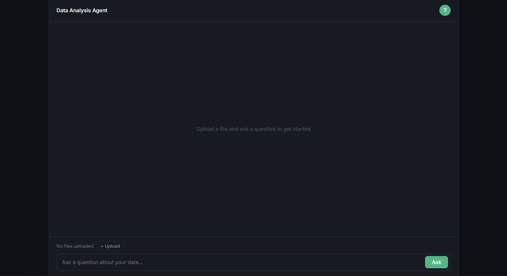
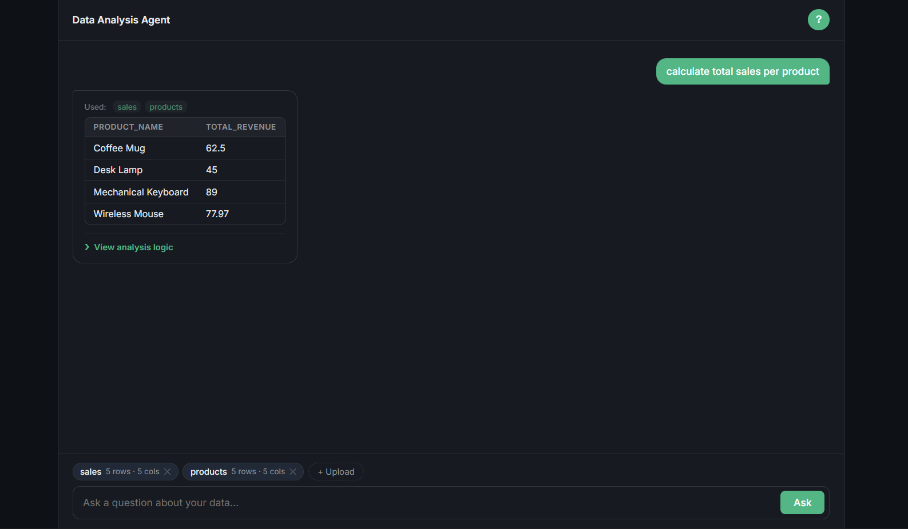
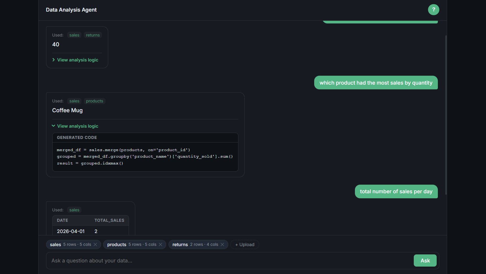
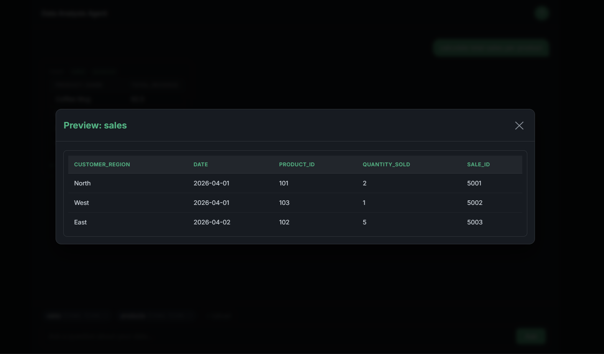

# Excel & CSV Analysis Agent

Ask plain English questions about your spreadsheets — no SQL, no formulas.

## Project Overview

This data agent lets you upload CSV or Excel files and query them conversationally. Under the hood, it uses Gemini to generate Python/Pandas code from your question, runs it in an isolated sandbox, and returns the result — as a table, a list, or a plain value depending on what makes sense.

You can also inspect any uploaded file by hovering over it (column names and types) or clicking it (data preview), and the generated code is always visible so you can see exactly how your answer was derived.

## Screenshots

## Features

**Upload & inspect files**
- Drag-and-drop or click to upload CSV and Excel files
- Hover a file badge to see column names and data types
- Click a file badge to preview the first few rows
- Remove individual files at any time

**Ask questions in plain English**
- Type any question about your data and get a structured answer
- Results render as a table, chips, scrollable list, or plain text, whichever fits
- Expand *View analysis logic* to see the generated Pandas code
- Off-topic questions are caught and rejected before any code runs

**Cancel queries**
- Cancel any processing questions mid-query
- Clear result cards to keep your workspace tidy

## Security
- Code execution runs in an isolated subprocess with a set timeout
- Generated code is validated against forbidden constructs before execution
- File paths are sanitised and validated to prevent directory traversal
- Rate limiting applied per IP address

## Limits

| Constraint | Limit |
|---|---|
| File size | 5 MB |
| Rows per file | 10,000 |
| Columns per file | 100 |
| Questions per minute | 5 |

## Supported File Types
- Excel (`.xlsx`, `.xls`)
- CSV (`.csv`)

## Tech Stack

- **Backend:** Flask
- **Frontend:** Javascript, HTML/CSS
- **AI API:** Google Gemini
